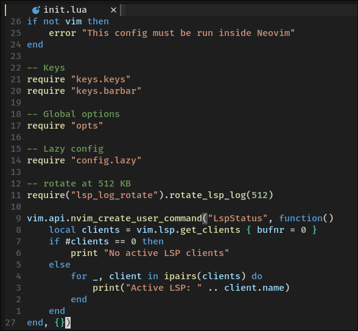

# Valtteri's Nvim Config

## Introduction

This is my personal Neovim setup, refined over the years. The changelog below goes all the way back to a Vim config from 2021, and most of what's in here survived by earning its place.

The philosophy is simple: Neovim is an editor, not an IDE. I don't want a million tools living inside my text editor. No terminal emulators, no file managers I never open, no plugin doing what a shell command already does. tmux handles splits, sessions and everything else Neovim shouldn't be doing, and the two bundle together nicely.

What's left is the part that actually makes editing good: every language I work with ships with its LSP and formatter already configured. Open a file and then completions, diagnostics and formatting just work.

## Features

### LSP

| Language                  | Filetype(s)                                                             | LSP server      | Executable                  |
| ------------------------- | ----------------------------------------------------------------------- | --------------- | --------------------------- |
| Lua                       | `lua`                                                                   | `lua_ls`        | `lua-language-server`       |
| Python                    | `python`                                                                | `pylsp`         | `pylsp`                     |
| JavaScript / TypeScript   | `javascript`, `javascriptreact`, `typescript`, `typescriptreact`, `vue` | `vtsls`         | `vtsls`                     |
| Go                        | `go`, `gomod`, `gowork`                                                 | `gopls`         | `gopls`                     |
| Rust                      | `rust`                                                                  | `rust_analyzer` | `rust-analyzer`             |
| C / C++ / Objective-C(++) | `c`, `cpp`, `objc`, `objcpp`                                            | `clangd`        | `clangd`                    |
| C#                        | `cs`                                                                    | `csharp_ls`     | `~/.dotnet/tools/csharp-ls` |
| Nix                       | `nix`                                                                   | `nixd`          | `nixd`                      |
| Shell                     | `sh`, `bash`, `zsh`                                                     | `bashls`        | `bash-language-server`      |
| LaTeX / BibTeX            | `tex`, `bib`                                                            | `texlab`        | `texlab`                    |
| Markdown                  | `markdown`, `markdown.mdx`                                              | `marksman`      | `marksman`                  |
| CMake                     | `cmake`, `CMakeLists.txt`                                               | `cmake`         | `cmake-language-server`     |

`:LspStatus` shows attached clients, workspace roots, server commands, formatting support, and external formatter availability.

Telescope file search, live grep, and file browsing start at the nearest project marker (such as `.git`, `Cargo.toml`, or `package.json`). Standalone files use their containing directory; unnamed buffers use the current working directory.

### Formatting

- **conform.nvim** formats on save with a 500 ms timeout and falls back to LSP formatting when no configured external formatter is available.
- Neovim’s built-in [EditorConfig support](https://neovim.io/doc/user/plugins/#editorconfig) is reloaded before automatic and manual formatting.
- `:Format` formats the current buffer; `:Formatters` shows external formatter availability.
- `:FormatToggle` toggles formatting on save globally; `:FormatToggleBuffer` toggles it for the current buffer. Both switches must be enabled for automatic formatting; manual formatting always remains available.
- Persistent undo preserves editing history across sessions. The sign column stays visible, scrolling keeps eight lines of context, and substitutions preview in a split.

#### Languages and formatters

| Language    | Filetype(s)                     | Formatter      | Arguments / notes                                                                       |
| ----------- | ------------------------------- | -------------- | --------------------------------------------------------------------------------------- |
| Lua         | `lua`                           | `stylua`       | options in [`stylua.toml`](stylua.toml)                                                 |
| Python      | `python`                        | `black`        | `--quiet`                                                                               |
| Go          | `go`                            | `gofumpt`      | `-extra`                                                                                |
| Rust        | `rust`                          | `rustfmt`      | Edition detected from Cargo.toml (defaults to 2021 for standalone files)                |
| Nix         | `nix`                           | `nixpkgs-fmt`  | `nixd` also advertises `nixfmt`, but conform wins when `nixpkgs-fmt` is installed       |
| C / C++     | `c`, `cpp`                      | `clang-format` | bundled default [`style`](clang-format-default/.clang-format) when the project has none |
| CMake       | `cmake`                         | `cmake-format` | —                                                                                       |
| LaTeX       | `tex`                           | `tex-fmt`      | —                                                                                       |
| Shell       | `sh`, `bash`, `zsh`             | `shfmt`        | —                                                                                       |
| JavaScript  | `javascript`, `javascriptreact` | `prettier`     | —                                                                                       |
| TypeScript  | `typescript`, `typescriptreact` | `prettier`     | —                                                                                       |
| Web         | `html`, `css`, `scss`           | `prettier`     | —                                                                                       |
| Data / docs | `json`, `yaml`, `markdown`      | `prettier`     | —                                                                                       |

### Keymaps

Leader is `<Space>`.

| Keys                                       | Mode | Action                                                                   |
| ------------------------------------------ | ---- | ------------------------------------------------------------------------ |
| `<leader>ff` / `<leader>fg` / `<leader>fb` | n    | Find project files / grep project / buffers                              |
| `<leader>fr` / `<leader>fh` / `<leader>fe` | n    | LSP references / help tags / file browser                                |
| `gd` / `gD` / `gr` / `gi` / `gy`           | n    | Definition / declaration / references / implementation / type definition |
| `<leader>rn`                               | n    | Rename symbol                                                            |
| `<leader>ih`                               | n    | Toggle inlay hints for the current buffer                                |
| `<leader>ca`                               | n, x | Code action                                                              |
| `K`                                        | n    | Hover documentation                                                      |
| `<leader>e`                                | n    | Show diagnostics in a float                                              |
| `<C-j>` / `<C-k>`                          | n    | Previous / next buffer                                                   |
| `<C-h>` / `<C-l>`                          | n    | Move buffer left / right                                                 |
| `<C-x>`                                    | n    | Close buffer                                                             |
| `<M-v>` / `<M-V>`                          | n    | Paste from the system clipboard (after / before)                         |
| `<C-n>` / `<C-p>` / `<CR>` / `<C-Space>`   | i    | Completion: next / previous / confirm / open menu                        |
| `<Tab>` / `<S-Tab>`                        | i, s | Completion confirm, snippet expand/jump forward / backward               |

## Changelog

### December 2021

- Original vim config with vundle
- Pick the codedark colorscheme that is used to this day

### August 2022

- Migrate to nvim with packer and lsp-zero.nvim
- barbar.nvim
- lualine.nvim

### January 2023

- Use mason.nvim for lsp
- nvim-web-devicons

### December 2023

- Add **telescope.nvim**

### April 2024

- More telescope keymaps

### January 2025

- Migrate to lazy.nvim

### February 2025

- New LSP keymaps

### July 2025

- Telescope file browser
- [NixOS support](../../../nixos/home/nvim.nix)

### December 2025

- New plugin structure, ditch mason.nvim
- LSP's on their own files

### January 2026

- Automatic formatting with **conform.lua**
- Add [`stylua.toml`](stylua.toml)
- More LSP's: CMake, Latex, Go, Bash, Markdown
- Add markview.nvim

### October 2026

- Default [`style`](clang-format-default/.clang-format) for formatting C/C++
- Nvim orgmode
